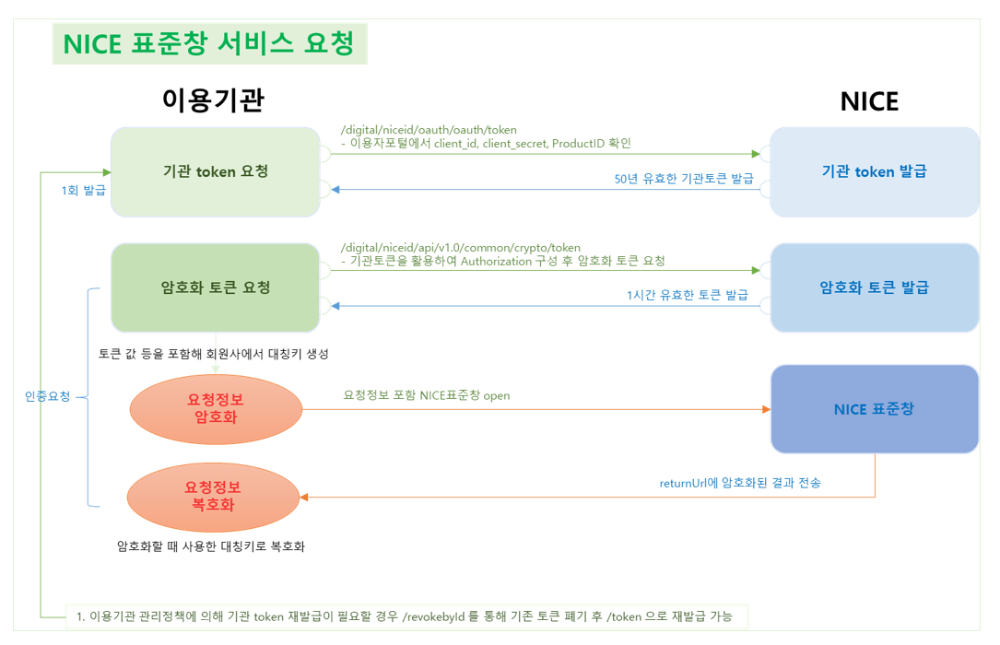
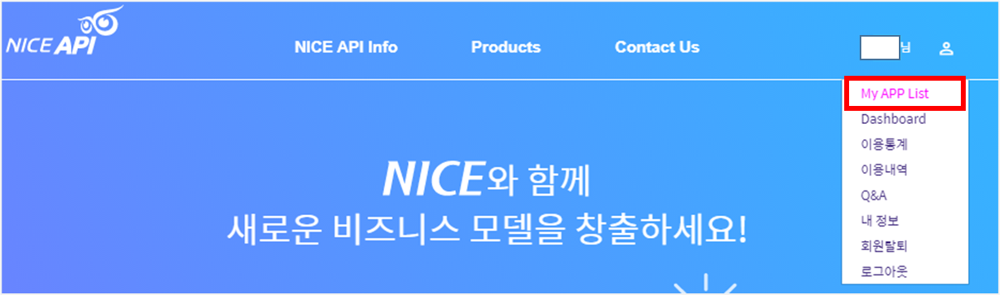
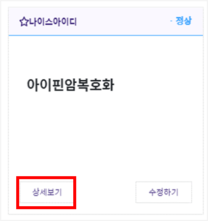
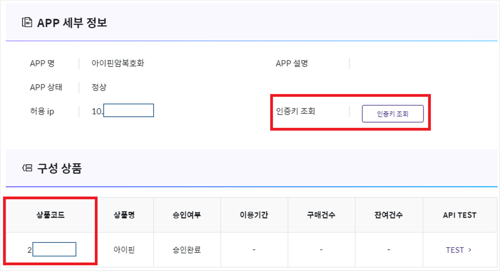
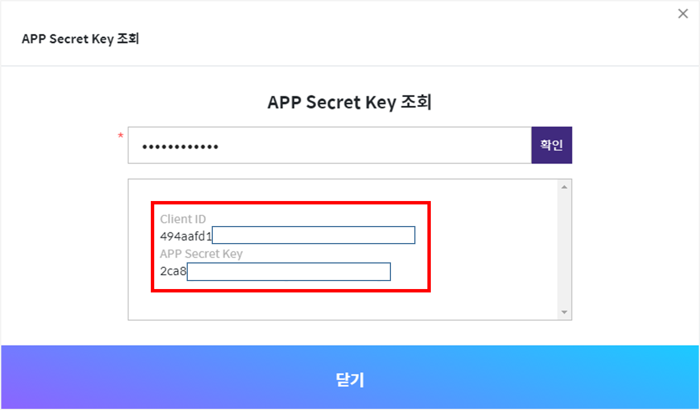

# nice-api-node
[NICE API][niceapi] 서비스를 [Node.js][node]에서 사용하기 위한 라이브러리 구현체 입니다. <br/>
현재 NICE 본인 확인 (통합형, API를 통한 NICE 표준창 호출) 서비스가 구현되어 있습니다. <br/>
추후 필요에 따라 다른 서비스도 추가할 예정입니다. <br/>
PR은 언제나 환영합니다.

### 📌 NICE 본인 확인 (통합형, API를 통한 NICE 표준창 호출)



NICE에서 제공된 흐름도를 참고하여 다음 기능이 내부적으로 구현되어 있고
> - 인증 기관 토큰 (AccessToken) 발급
> - 암호화 토큰 (CryptoToken) 발급
> - 대칭키 생성
> - 인증 요청 데이터 암호화 (AES128/CBC/PKCS7)
> - 인증 결과 데이터 복호화

다음 기능을 외부로 제공합니다.
> - 표준창 서비스 호출시 필요한 요청 데이터 생성 ( generateRequestData )
> - 본인 인증 결과로 받은 암호화된 데이터 복호화 ( decryptResultData )

## 📦 설치방법
```bash
$ npm install nice-auth-node
or
$ yarn add nice-auth-node
```

## 🚀 사용 방법

라이브러리 초기화
```javascript
// import
const { NiceAuth, NiceAuthError } = require('nice-api-node')

// NICE에서 제공된 clientId, clientSecret, productId로 NiceAuth 인스턴스 생성
const niceAuth = new NiceAuth({
    clientId: '<client id>',
    clientSecret: '<client secret>',
    productId: '<product id>'
})
```

NICE 표준창을 호출하기 위한 요청데이터 생성
```javascript
try {
    const requestData = await niceAuth.generateRequestData({
        requestno: '123456789', // 최대 30자
        returnurl: 'http://localhost:3000/test',
        authtype: 'M',
        methodtype: 'post',
        popupyn: 'Y',
        receivedata: JSON.stringify({ foo: 'var' }),
    });
    console.log(requestData);
} catch (e) {
    // 오류 처리
    if (e instanceof NiceAuthError.AccessTokenError) {
        console.log('액세스 토큰 발급 실패!');
    } else if (e instanceof NiceAuthError.CryptoTokenError) {
        console.log('암호화 토큰 발급 실패!');
    } else if (e instanceof NiceAuthError.SymmetricKeyError) {
        console.log('대칭키 생성 실패!');
    } else if (e instanceof NiceAuthError.EncryptDataError) {
        console.log('요청 데이터 암호화 실패!');
    } else if (e instanceof NiceAuthError.IntegrityValueError) {
        console.log('무결성 검증 값 생성 실패!');
    } else {
        console.log('기타 오류')
    }
}
```
generateRequestData 함수 호출 파라미터

| 항목           | 필수 | 타입      | 길이   | 고정값       | 설명                                                                   |
|--------------|----|---------|------|-----------|----------------------------------------------------------------------|
| requestno    | Y  | String  | 30   |           | 서비스 요청 고유 번호                                                         |
| returnurl    | Y  | String  | 250  |           | 인증 결과를 받을 URL                                                        |
| authtype     | N  | String  | 1    |           | 인증수단 고정 (M:휴대폰인증,C:카드본인확인인증,X:인증서인증,U:공동인증서인증,F:금융인증서인증,S:PASS인증서인증) |
| mobilceco    | N  | String  | 1    |           | 이통사 우선 선택(S : SKT, K : KT, L : LGU+)                                 |
| businessno   | N  | String  | 10   |           | 사업자번호(법인인증인증에 한함)                                                    |
| methodtype   | N  | String  | 3~4  | post,get  | 결과 URL 전달시 http method타입                                             |
| popupyn      | N  | String  | 1    | Y, N      | 팝업                                                                   |
| receivedata  | N  | String  | -    |           | 인증 후 전달받을 데이터 세팅 (요청값 그대로 리턴)                                        |

generateRequestData 호출 결과
```
{
  symmetricKey: 'symmetric key value', // symmetricKey는 노출이 안되도록 서버 어딘가에 저장
  formData: {
    tokenVersionId: 'tokenVersionId value',
    encData: 'encData value',
    integrityValue: 'integrityValue value',
  }
}
```

generateRequestData의 결과를 사용하여 다음과 같은 형태로 form을 생성하고 submit하여 사용자 본인 인증 시작
```html
<form name="form" id="form" action="https://nice.checkplus.co.kr/CheckPlusSafeModel/service.cb">
  <input type="hidden" id="m" name="m" value="service" />
  <input type="hidden" id="token_version_id" name="token_version_id" value="tokenVersionId" />
  <input type="hidden" id="enc_data" name="enc_data" value="encData" />
  <input type="hidden" id="integrity_value" name="integrity_value" value="integrityValue" />
</form>
```
사용자가 본인 인증을 완료하면 generateRequestData 호출 시 넘겼던 returnurl로 다음 데이터가 넘어옴
```
{
  "token_version_id": "value",
  "enc_data": "value",
  "integrity_value": "value"
}
```

사용자 본인 인증 결과로 받은 암호화된 데이터를 복호화 하기 위해 decryptResultData 호출
```javascript
try {
    // 서버 어딘가에 저장된 symmetricKey
    const symmetricKey = keyStorage.get('requestNo');

    // 사용자 본인 인증 결과
    const authResultData = {
        token_version_id: 'value',
        enc_data: 'value',
        integrity_value: 'value',
    };

    const decryptedData = niceAuth.decryptResultData({
        symmetricKey: symmetricKey,
        integrityValue: authResultData.integrity_value,
        cipherData: authResultData.enc_data,
    });

    console.log(decryptedData);
} catch (e) {
    if (e instanceof NiceAuthError.DecryptDataError) {
        console.log('데이터 복호화 실패');
    } else {
        console.log('another');
    }
}

```

인증결과 데이터

| 항목           | 필수 | 타입     | 길이   | 설명                       |
|--------------|----|--------|------|--------------------------|
| resultcode   | Y  | String | 4    | 결과코드                     |
| requestno    | Y  | String | 30   | 요청 고유 번호(회원사에서 전달보낸 값)   |
| enctime      | Y  | String | 14   | 암호화 일시(YYYYMMDDHH24MISS) |
| sitecode     | Y  | String | 16   | 사이트코드                    |
| responseno   | Y  | String | 24   | 응답고유번호                   |
| authtype     | Y  | String | 1    | 인증수단                     |
| name         | N  | String | 100  | 이름                       |
| utf8_name    | N  | String |      | UTF8로 URLEncoding된 이름 값  |
| birthdate    | N  | String | 8    | 생년월일 8자리                 |
| gender       | N  | String | 1    | 성별                       |
| nationalinfo | N  | String | 1    | 내외국인                     |
| mobile_co    | N  | String | 1    | 이통사 구분(휴대폰 인증 시)         |
| mobile_no    | N  | String | 1    | 휴대폰 번호(휴대폰 인증 시)         |
| ci           | N  | String | 88   | 개인 식별 코드(CI)             |
| di           | N  | String | 64   | 개인 식별 코드(DI)             |
| businessno   | N  | String | 10   | 사업자번호(법인인증서 인증시)         |
| receivedata  | N  | String |      | 요청 시 전달 받은 RECEIVEDATA   |


### 서비스 키 확인 방법








[node]: http://nodejs.org/
[niceapi]: https://www.niceapi.co.kr/